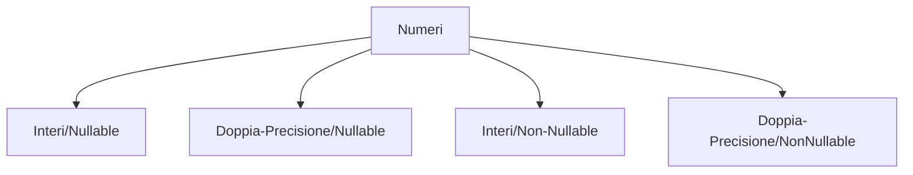
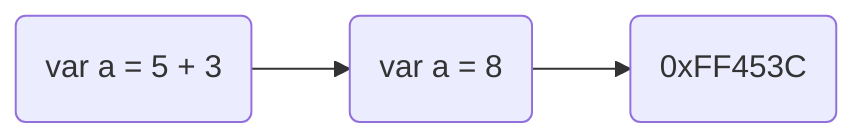

# Introduzione a Dart :


> ##  Dart :

- Linguaggio di programmazione orientanto agli oggetti
- Linguaggio tipizzato
- Linguaggio C-Like (Imperativo come Java e C)
- Gestione della memoria mediante garbage collection

---
> ## Come funziona Dart ?

<div align ='center'>

|Standalone :             |       Compilato :                 |     Web :         |
|    :---                 |             :---                  |     :--           |
|- Just In Time (JIT)     |       - Ahead of Time (AOT)       |     - Traspilato  |
|- Interpretato           |       - Compilato                 |     - No DVM      |
|- Dart Virtual Machine   |       - No DVM                    |     - Browser     |
|- Basse prestazioni      |       - Alte prestazioni          |                   |
|- Multiplatform          |       - MultiPlatform             |                   |

</div>

---

> ## Indice dei contenuti :

<br>

*Il linguaggio :*

1. [Variabili e Tipi](#variabili-e-tipi)
2. [I Modificatori](#i-modificatori)
3. [Null-safety](#null-safety)
4. [Operatori](#operatori)
5. [Costrutti di selezione](#costrutti-di-selezione)
6. [Costrutti di iterazione](#costrutti-di-iterazione)
7. [Le asserzioni](#le-asserzioni)
8. [Funzioni](#funzioni)

*Paradigma Object Oriented :*


9.  [Classi](#classi)
10. [Costruttori](#costruttori)
11. [Getters e Setters](#getters-e-setters)
12. [Ereditarietà](#ereditarietà)
13. [Classi Astratte](#classi-astratte)
14. [Interfacce](#interfacce)
15. [Extensions](#extensions)
16. [Mixins](#mixins)
17. [Generics](#generics)
18. [Attributi e metodi statistici](#attributi-e-metodi-statistici)
19. [Classi invocabili](#classi-invocabili)
20. [Enum](#enum)

*Dart Avanzata :*

21. [Eccezioni](#eccezioni)
22. [Librerie](#librerie)
23. [Commenti](#commenti)

*Programmazione Asincrona :*

24. [Future](#future)
25. [Stream](#stream)
26. [Isolate](#isolate)
---
> ## Variabili e Tipi 
<br>

Variabile = rappresentazione in memoria di un determinato dato

 Dichiarazione della variabile può essere esplicita o implicita : <br>
>- Esplicita => String , Int , Boolean (nome-della-varibile) <br>
>- Implicita => var (nome-della-variabile) è il compiltare a stabilirne il tipo

I tipi possono : Numeri , Stringe , Boolean , Liste , Set , Dizionari 

Numeri  = Interi / Floating Point <br>
Stringe = Carattarei Alpha Numerici <br>
Boolean = True o False

>Liste = Elementi seguono un certo ordine , sono numerati. <br>
>Set   = Gli elementi non hanno vincoli sull'ordine. <br>
>Dizionari = Ogni elemento è associato ad una chiave. <br>

Tipo speciale : `dynamic`

`Dynamic` : Quando il tempo della variabile non è noto durante la compilazione

Esempio di variabile non esplicita :

```Dart
 void main (){
    var Francois;
    Francois = "Francois"; 
    print(Francois);
 }
```
Alla variabile **Francois** , viene assegnato solo nella seconda riga il tipo di valore che conterra che in questo caso è una stringa , il compilatore automaticamente ne determinerà il tipo.

Il Dizionario in dart è una classe di tipo Map , quando si ripete nel codice lo stesso di tipo di elemento e conveniente ed efficente utilizzare un typedef per ridefinire il "nome" del tipo.

```Dart
typedef Dizionario = Map <String,int>;

void main (){
    Dizionario Dictionary = {
      "Francois":10;
      "Manuel":9;
      "Mario":8;
    }
}
```


[Esempi di codice su Variabili e Tipi in Dart]

---
> ## I Modificatori 
<br>

Le variabili possono dotarsi di particolari modificatori che ne cambiano il comportamento

Modificatori :
>- Late : Dichiarare una variabile senza assegnare un valore,allocando >memoria solamente nel momento in cui è utilizzata
>- Const : La variabile viene destinata in un area di memoria che >assumerà un specifico valore che non può cambiare durante l'esecuzione
>- Final : La variabile viene destinata in un area di memoria che assumerà un valore che rimmarà constante durante l'esecuzione

[Esempi di codice su Modificatori in Dart] :

---
>## Null-Safety 
<br>

Partendo dalla versione 2.14 di Dart tutte le variabili sono per dafault inizzializzate a `"NULL"`, ammettendo che durante l'esecuzione una variabile potrebbe essere null.

In questo modo il dominio dei tipi delle variabili raddoppia, esempio fatto con i tipi Numerici :



[Esempi di codice su Null-Safety in Dart] : 

---
>## Operatori 
<br>

Una variabile è detta tale perchè può essere modifica nel tempo, per fare ciò bisogna assegnare un espressione che essere stata valutata assegnerà la variabile al suo indirizzo di memoria


>Diversi tipi di operatori :
>- Aritmetici : Somma ( + ) , Sottrazione ( - ) , Moltiplicazione ( * ), Divisione ( / ), Divisione Intera ( ~/ ) , Modulo ( % ) , Incremento ( ++ ) , Decremento ( -- )
>- Relazionali : Maggiore ( > ) , Minore ( < ), Maggiore Uguale ( >= ), Minore Uguale ( <= ) , Uguale ( == ) , Diverso ( != )
>- Controllo dati strutturati : ( is ) , ( is! )
>- Bitwise : And ( & ) , Or ( | ) , Xor ( ^ ) , Complemento ( ~ ) , Shift a Sinistra ( << ) , Shift a destra ( >> )
>- Assegnazione : Assegnazione ( = ) , Assegna se null ( ??= ) , Somma e assegna ( += ) , Sottrai e assegna ( -= ) , Moltiplica e assegna ( *= ) , Dividi e assegna ( /= ) 
>- Concatenazione logica : And ( && ) , Or ( || ) , Not ( ! )
>- Condizionali : Operatore ternario ( a ? b : c ) , Null coalescing ( a ?? b )

// `Operatore ternario` : Se 'a' è `True` esegui 'b' se no fai 'c'


[Esempi di codice su Operatori in Dart] : 

---
>## Costrutti di selezione 
<br>

Un costrutto di selzione è uno strumento utilizzato al verificarsi di determinate condizioni per rendere più chiaro il programma o una specifica funzione.

Sono costrutti di selezione : `if , if else , switch `.


[Esempi di codice su Costrutti di selezione in Dart] : 

---
>## Costrutti di iterazione 
<br>

Un costrutto di iterazione è uno strumento utilizzato per iterare una serie di istruzioni al verificarsi di determinate condizioni per rendere più chiaro il programma o una specifica funzione.

Sono costrutti di iterazione : `For , While , Do While`.


[Esempi di codice su Costrutti di iterazione in Dart] : 

---
>## Le asserzioni 
<br>

Come i costrutti di selezione si utilizzano al verificarsi di determinate condizioni , in questo cosa il codice viene eseguito solo in caso di positività delle condizioni viceversa verrà rilasciata una eccezzione.

Vengono utilizzate per determinare alcuni casi limite , ma solamente in modalità `debug` , in modalità `release` non rilasceranno alcuna eccezzione.

[Esempi di codice su Le asserzioni in Dart] : 

--- 
>## Funzioni 
<br>

Quando il codice da eseguire diventa troppo lungo,  il che lo può rendere poco chiaro oppure ci si rende conto di dover eseguire in più punti del 
programma le stesse istruzioni allora può essere utile incampsularle in funzioni.
> Una funzione può essere chiamata e valutata come una normale espressione e può restituire una valore in `output` che dipende da una serie di parametri dati in `input` , le funzioni vengono trattate come ogettti e ha uno specifico nome `fuction` e possono essere assegnate a variabili o passate come parametri ad altre funzioni.


`Cascate Notation` : L'arrow function addItemCascateNotation utilizza list.add che resistuisce per dafautl void ma con l'operatore '.' permette di restituire l'oggetto che precede l'istruzione in questo caso `list`

```Dart

// Cascate Notation
final list = ["Marco","Francesco", "Luca"];
addItem("Giulio", list: list);
print (list);

addItemCascateNotation("Simone", list: list);
print(list);

List <String> addItem(String item , {required List<String> list}){
  list.add(item);
  return list;
}

List <String> addItemCascateNotation(String item , {required List<String> list}) => list..add(item)..removeAt(0);

```

[Esempi di codice su Funzioni in Dart] : 

---
>## Classi 
<br>

Gli oggetti sono istanze di classi , le classi sono un modello o astrazioni di un concetto che possiede attribuiti e metodi ad esempio una persona 


> Persona è `la classe` , i suoi attributi sono nome , cognome ecc..
> i suoi metodi sono cammina , parla e mangia...
<br>

> Mario Rossi è `l'oggetto` che ha metodi e attributi della classe.


[Esempi di codice su Classi in Dart] :

---
>## Costruttori 
<br>

Non è sempre possibile assegnare i valori direttamente agli attributi , soprattuto quando si vuole garantire l'incapsulamento e l'information hiding per cui i dettagli implementativi di una classe devono rimanere nascosti all'utente... rendendo gli attributi privati anteponendo un ` "_" ` davanti al nome della variabile , generando un cotruttore che ha dei parametri che utilizzeremo per avvalorare gli attributi.

>Tutte le classi che non hanno un costruttore personalizzato ne hanno uno di default

>`I costruttori sono delle vere e proprie funzioni , inoltre
dentro le classi e possibili creare più costruttori`


[Esempi di codice su Costruttori in Dart] :

---
>## Getters e Setters 
<br>

Gli unici metodi capaci di modificare gli attributi di una classe sembrano essere i costruttori ma in realtà non è cosi in Dart ci sono dei metodi speciali chiamati `Setters` che consentono di manipolare gli **attributi privati** di una classe , mentre per accedere agli **attributi privati** di una classe in Dart è possibile creare dei `Getters`.


[Esempi di codice su Getters e Setters in Dart] : 

---
>## Ereditarietà 
<br>


È il classico concetto di erditirarietà presente nei linguaggi `Object - Oriented` in cui viene richiesta una nuova classe (figlo) che presenti metodi e attributi della classe (padre).

>Poniamo il caso di volere specializzare la classe `'Persona'` 


@override indica un `metadata` , viene posto prima della stesura di un qualunque metodo nella classe ereditaria, per definare la funzione ch'è stata anche utilizzata nella classe (padre) da cui derivano i parametri.

>Nella costruzione di una nuova classe (figlia) bisogna ricordare di creare un costruttore che assegni gli attributi della classe (padre) , viene utilizzata la parole `super` per alcune assegnazioni.


[Esempi di codice su Ereditarietà in Dart] : 

---
>## Classi Astratte 
<br>

Non è sempre possibile per una classe figlio instanziare una classe padre allora vengono utilizzate le classi astratte.


> Un animale ad esempio non può essere instanziato perch'è un `concetto astratto` la zebra , il leone , il cane hanno solo alcuni attributi in comune)


[Esempi di codice su Classi Astratte in Dart] : 

---
>## Interfacce 
<br>

Per garantire *l'incapsulamento* relativamente ai metodi di una classe si fa uso delle `interfaccie` che permettono di definire un insieme di firme che dovranno essere rispettate ed implementate dalle classi alle quali queste ultime decido di aderire , per firma si intende la semplice intestazione di un metodo privo del suo contenuto.

> Per istruire una classe ad aderire alle firme di un altra si utilizza la parola `implements`


[Esempi di codice su Interfacce in Dart] :

---
>## Extensions 
<br>


[Esempi di codice su Extensions in Dart] : 

---
>## Mixins 
<br>

[Esempi di codice su Mixins in Dart] : 

---
>## Generics 
<br>

[Esempi di codice su Generics in Dart] : 

---
>## Attributi e metodi statistici 
<br>

[Esempi di codice su Attributi e metodi statici in Dart] : 

---
>## Classi invocabili 
<br>

[Esempi di codice su Classi invocabili in Dart] : 

---
>## Enum 
<br>

[Esempi di codice su Enum in Dart] : 

---
>## Eccezioni 
<br>

[Esempi di codice su Eccezioni in Dart] : 

---
>## Librerie 
<br>

[Esempi di codice su Librerie in Dart] : 

---
>## Commenti 
<br>

[Esempi di codice su Commenti in Dart] : 

---
>## Future 
<br>

[Esempi di codice su Future in Dart] : 

---
>## Stream 
<br>

[Esempi di codice su Stream in Dart] : 

---
>## Isolate 
<br>

[Esempi di codice su Isolate in Dart] : 

---


[Esempi di codice su Variabili e Tipi in Dart]: <https://github.com/zPhooenix/Dart/blob/main/Varibili%20e%20Tipi.dart>
[Esempi di codice su Modificatori in Dart]: <https://github.com/zPhooenix/Dart/blob/main/Modificatori.dart>
[Esempi di codice su Null-Safety in Dart]: <https://github.com/zPhooenix/Dart/blob/main/Null-Safety.dart>
[Esempi di codice su Operatori in Dart]: <https://github.com/zPhooenix/Dart/blob/main/Operatori.dart>
[Esempi di codice su Costrutti di selezione in Dart]: <https://github.com/zPhooenix/Dart/blob/main/Costrutti%20di%20selezione.dart>
[Esempi di codice su Costrutti di iterazione in Dart]: <https://github.com/zPhooenix/Dart/blob/main/Costrutti%20di%20iterazione.dart>
[Esempi di codice su Le asserzioni in Dart]: <https://github.com/zPhooenix/Dart/blob/main/Le%20asserzioni.dart>
[Esempi di codice su Funzioni in Dart]: <https://github.com/zPhooenix/Dart/blob/main/Funzioni.dart>
[Esempi di codice su Classi in Dart]: <https://github.com/zPhooenix/Dart/blob/main/Classi.dart>
[Esempi di codice su Costruttori in Dart]: <https://github.com/zPhooenix/Dart/blob/main/Costruttori.dart>
[Esempi di codice su Getters e Setters in Dart]: <https://github.com/zPhooenix/Dart/blob/main/Getters%20e%20Setters.dart>
[Esempi di codice su Ereditarietà in Dart]: <https://github.com/zPhooenix/Dart/blob/main/Ereditariet%C3%A0.dart>
[Esempi di codice su Classi Astratte in Dart]: <https://github.com/zPhooenix/Dart/blob/main/Classi%20Astratte.dart>
[Esempi di codice su Interfacce in Dart]: <https://github.com/zPhooenix/Dart/blob/main/Interfacce.dart>
[Esempi di codice su Extensions in Dart]: <https://github.com/zPhooenix/Dart/blob/main/Extensions.dart>
[Esempi di codice su Mixins in Dart]: <https://github.com/zPhooenix/Dart/blob/main/Mixins.dart>
[Esempi di codice su Generics in Dart]: <https://github.com/zPhooenix/Dart/blob/main/Generics.dart>
[Esempi di codice su Attributi e metodi statici in Dart]: <https://github.com/zPhooenix/Dart/blob/main/Attributi%20e%20metodi%20statici.dart> 
[Esempi di codice su Classi invocabili in Dart]: <https://github.com/zPhooenix/Dart/blob/main/Classi%20Invocabili.dart>
[Esempi di codice su Enum in Dart]: <https://github.com/zPhooenix/Dart/blob/main/Enum.dart>
[Esempi di codice su Eccezioni in Dart]: <https://github.com/zPhooenix/Dart/blob/main/Eccezioni.dart>
[Esempi di codice su Librerie in Dart]: <https://github.com/zPhooenix/Dart/blob/main/Librerie.dart>
[Esempi di codice su Commenti in Dart]: <https://github.com/zPhooenix/Dart/blob/main/Commenti.dart>
[Esempi di codice su Future in Dart]: <https://github.com/zPhooenix/Dart/blob/main/Future.dart>
[Esempi di codice su Stream in Dart]: <https://github.com/zPhooenix/Dart/blob/main/Stream.dart>
[Esempi di codice su Isolate in Dart]: <https://github.com/zPhooenix/Dart/blob/main/Isolate.dart>

